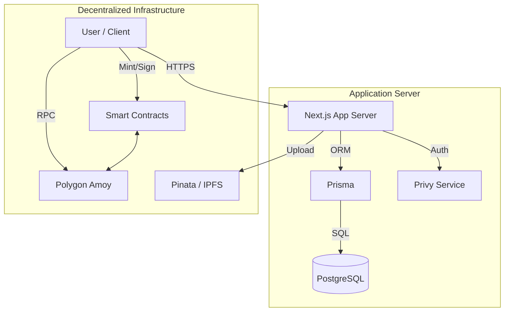

# Sonar Social (formerly CR8TE)

**Sonar Social** is a next-generation "Web2.5" social music platform that bridges the gap between streaming, social media, and blockchain ownership. It features a premium **Glassmorphism** UI ("Deep Sea" & "Real Glass" themes) and empowers artists with direct-to-fan monetization via Fan Clubs and on-chain music assets.

---

## 📚 Table of Contents
- [System Architecture](#system-architecture)
- [Technical Stack](#technical-stack)
- [Data Flow](#data-flow)
- [Layers Breakdown](#layers-breakdown)
  - [Execution Layer](#execution-layer)
  - [Application Layer](#application-layer)
  - [Presentation Layer](#presentation-layer)
- [Known Issues & Roadmap](#known-issues--roadmap)
- [Getting Started](#getting-started)

---

## 🏗 System Architecture

Sonar Social operates as a hybrid application:
1.  **Social Graph & User Data**: Stored off-chain in a relational database (PostgreSQL) for speed and complex queries (feeds, comments, clubs).
2.  **Music Assets & Ownership**: Stored on-chain (Polygon Amoy) and decentralized storage (IPFS) to ensure artist ownership and provenance.
3.  **Authentication**: Handled via **Privy**, enabling "invisible" wallet creation for Web2 users while supporting external wallets for Web3 natives.

### High-Level Diagram


---

## 🛠 Technical Stack

### **Frontend & Framework**
-   **Framework**: [Next.js 16](https://nextjs.org/) (App Router)
-   **Language**: TypeScript
-   **Styling**: [Tailwind CSS v4](https://tailwindcss.com/), [Shadcn UI](https://ui.shadcn.com/)
-   **Icons**: Lucide React
-   **Animations**: `tailwindcss-animate`

### **Web3 & Blockchain**
-   **Auth & Wallets**: [Privy](https://www.privy.io/)
-   **Blockchain Interaction**: [Wagmi](https://wagmi.sh/) / [Viem](https://viem.sh/)
-   **Smart Contracts**: Solidity (Hardhat)
-   **Storage**: IPFS (via Pinata)

### **Backend & Database**
-   **Database**: PostgreSQL
-   **ORM**: [Prisma](https://www.prisma.io/)
-   **API**: Next.js API Routes (Serverless functions)

---

## 🔄 Data Flow (Sonar V3 Hybrid Model)

1.  **Upload (Multi-Track)**:
    *   Artist drags & drops Album/EP audio files.
    *   Frontend uploads to **IPFS** (Pinata) and generates metadata.
    *   Backend (`/api/music/upload`) creates relational records in **SQLite** (Collection + Tracks).
2.  **Minting (Gasless)**:
    *   Artist clicks "Mint".
    *   Backend (`/api/music/mint`) uses Admin Private Key to execute `mintTo` on **Polygon Amoy**.
    *   Zero cost to the artist; completely seamless UX.
3.  **Playback & Streaming**:
    *   Frontend fetches tracks from **Database** (Fast, Rich Metadata) via `/api/music/feed` or `/api/users`.
    *   User plays a song -> `SongCard` uses cached IPFS Gateway URL.
    *   After 30s, `GlobalPlayer` triggers `/api/music/stream` to increment counters in DB.

---

## 🌟 Sonar V3 Features
*   **Multi-Track Releases**: Support for Singles, EPs (2-6 tracks), and Albums (7+).
*   **Stream Analytics**: Real-time play counting and "Top Tracks" sorting.
*   **Hybrid Discovery**: Search and Discover feeds powered by Database for instant results, backed by on-chain provenance.
*   **Gasless Operations**: Server-side transaction handling for smoother onboarding.

---

## 🍰 Layers Breakdown

### 1. Execution Layer (Runtime)
*   **Environment**: Node.js (Server actions/API), Browser (Client components).
*   **Chain**: EVM-compatible Polygon Amoy Testnet.

### 2. Application Layer (Logic)
*   **Routing**: Next.js App Router (`src/app`).
    *   `(portal)`: Authenticated main app views.
*   **Business Logic**:
    *   `src/components/music`: Player logic, Song cards.
    *   `src/components/social`: Feed, Posts, Comments.
    *   `src/components/web3`: Minting, Wallet interactions.
*   **Data Models**: See `prisma/schema.prisma` for strict typing of Users, Posts, Clubs, and Tiers.

### 3. Presentation Layer (UI/UX)
*   **Design System**: **Glassmorphism**.
    *   **Night Mode (Default)**: Deep Purple/Black backgrounds, neon accents.
    *   **Light Mode**: "Real Glass" aesthetic with frosty transparency and light backgrounds.
*   **Key Components**:
    *   **AppShell**: Floating Glass Sidebar & Sticky TopBar.
    *   **GlobalPlayer**: Persistent "Glass Capsule" player bar.
    *   **Dashboard**: Analytics and Management panels in glass containers.

---

## 🐛 Known Issues & Roadmap

### ⚠️ Current Limitations / Bug Risks
1.  **Legacy Dependencies**: The codebase is migrating from **Ant Design** to **Shadcn/Tailwind**.
    *   *Risk*: Some deep-nested components (like complex forms or legacy modals) might still depend on Antd styles, causing minor visual inconsistencies or "flashing" styles.
    *   *Fix*: ongoing refactor to replace all `antd` imports.
2.  **Theme Toggle**: The Day/Night toggle is new.
    *   *Risk*: Hardcoded text colors (e.g., `text-white`) might invisible text in Light Mode in obscure corners of the app.
3.  **Blockchain Latency**:
    *   *Risk*: After minting, the item might not appear instantly in the feed due to indexing delays.
    *   *Mitigation*: We use Optimistic UI updates where possible, but a hard refresh is sometimes needed.

---

## 🚀 Getting Started

1.  **Install Dependencies**:
    ```bash
    npm install
    # or
    pnpm install
    ```

2.  **Environment Setup**:
    Ensure `.env.local` contains:
    *   `NEXT_PUBLIC_PRIVY_APP_ID`
    *   `DATABASE_URL`
    *   `PINATA_JWT`
    *   `NEXT_PUBLIC_CONTRACT_ADDRESS`

3.  **Run Development Server**:
    ```bash
    npm run dev
    ```
    Visit `http://localhost:3000`.

4.  **Database Sync**:
    ```bash
    npx prisma db push
    ```
